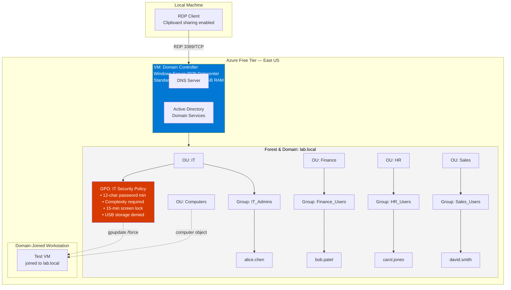

# Azure Active Directory Domain Lab

**Deploy and configure Active Directory Domain Services (AD DS) on a Windows Server virtual machine hosted in Microsoft Azure.**


---

## Overview

This guide provides step-by-step instructions to deploy and configure Active Directory Domain Services (AD DS) on a Windows Server virtual machine hosted in **Microsoft Azure**. You will practice launching an Azure VM, promoting it to a Domain Controller, and managing core identity components like Organizational Units (OUs), security groups, user accounts, and Group Policy.

### Watch Me Build This Lab Here!

<!-- Replace with your own screen recording link (Loom, YouTube, etc.) once you have one -->
- *[Add a walkthrough video link here]*

---

## Prerequisites

- Azure account (Azure Free Account works — includes $200 credit)
- Existing or new Resource Group
- Network Security Group (NSG) allowing RDP (port 3389)
- Windows Server 2025 Datacenter image (includes free 180-day evaluation licence)

---

## Architecture

The lab consists of a single Domain Controller running AD DS + DNS for the `lab.local` forest, an organisational unit structure mapped to departments, role-based security groups, and a Group Policy Object enforcing baseline security settings across the IT OU. A second VM domain-joins to validate that policy is actually being pushed and enforced.



---

## Steps

### 1. Launch the Windows Server Virtual Machine

1. Sign in to the **Azure Portal** (portal.azure.com).
2. Go to **Virtual machines → Create → Azure virtual machine**.

<!--  -->

3. Choose the **Windows Server 2025 Datacenter (Gen2)** image.
4. Select a VM size — `Standard_B2s` (2 vCPU / 4GB RAM) is enough for this lab and fits within free-tier credit.

<!--  -->
<!--  -->

5. Configure **networking**:
   - Place the VM in your target Virtual Network (VNet) and subnet.
   - Leave **Public inbound ports** open for RDP if connecting over the internet.
6. Set **Authentication type** to Password and record a strong admin password.
7. Configure the **Network Security Group (NSG)** to allow:
   - TCP 3389 (RDP) from your IP

<!--  -->

8. Click **Review + Create**, then **Create**.

<!--  -->

> Stop the VM (don't delete it) between sessions — a `Standard_B2s` VM costs roughly $0.05/hour, and stopping it pauses compute billing while preserving your configuration.

---

### 2. Connect to the Instance via RDP

1. Once the VM is running, note its **public IP address** from the Overview page.
2. In the Azure Portal, click **Connect → RDP → Download RDP File**.
3. Open the downloaded `.rdp` file with the native Remote Desktop app (not the browser console — clipboard sharing is limited there).
4. Before connecting, click **Show Options → Local Resources tab** and check **Clipboard** so you can paste commands into the VM.
5. Connect using the admin username and password you set at VM creation.

<!--  -->
<!--  -->

---

### 3. Install Active Directory Domain Services (AD DS)

1. In **Server Manager**, select **Manage → Add Roles and Features**.
2. Proceed through the wizard:
   - Select **Role-based or feature-based installation**.
   - Choose your server.
   - Check **Active Directory Domain Services**.
   - Add required management tools and install.

<!--  -->
<!--  -->

Or install via PowerShell:

```powershell
Install-WindowsFeature -Name AD-Domain-Services -IncludeManagementTools
Install-WindowsFeature -Name GPMC   # Group Policy Management Console — needed later, install now
```

---

### 4. Promote the Server to a Domain Controller

1. After installation, click the **flag icon** in Server Manager.
2. Select **Promote this server to a domain controller**.
3. Choose:
   - **Add a new forest**
   - Root domain name: `lab.local`
4. Set a **Directory Services Restore Mode (DSRM)** password.
5. Accept the default DNS and NetBIOS options, complete the wizard, and let the server restart.

<!--  -->
<!--  -->
<!--  -->

Or promote via PowerShell:

```powershell
Import-Module ADDSDeployment
Install-ADDSForest `
  -DomainName 'lab.local' `
  -DomainNetBiosName 'LAB' `
  -InstallDns:$true `
  -SafeModeAdministratorPassword (ConvertTo-SecureString 'YourDSRMPassword!' -AsPlainText -Force) `
  -Force:$true
```

---

### 5. Build Out the Directory Structure

1. Log in again after reboot.
2. Open **Active Directory Users and Computers (ADUC)** from the Tools menu.
3. Create Organizational Units (OUs) for each department.
4. Create role-based security groups inside each OU.
5. Create test user accounts and add them to the appropriate group.

<!--  -->
<!--  -->
<!--  -->

```powershell
# Organizational Units
New-ADOrganizationalUnit -Name "IT"        -Path "DC=lab,DC=local"
New-ADOrganizationalUnit -Name "Finance"   -Path "DC=lab,DC=local"
New-ADOrganizationalUnit -Name "HR"        -Path "DC=lab,DC=local"
New-ADOrganizationalUnit -Name "Sales"     -Path "DC=lab,DC=local"
New-ADOrganizationalUnit -Name "Computers" -Path "DC=lab,DC=local"

# Security groups
New-ADGroup -Name "IT_Admins"     -GroupScope Global -GroupCategory Security -Path "OU=IT,DC=lab,DC=local"
New-ADGroup -Name "Finance_Users" -GroupScope Global -GroupCategory Security -Path "OU=Finance,DC=lab,DC=local"
New-ADGroup -Name "HR_Users"      -GroupScope Global -GroupCategory Security -Path "OU=HR,DC=lab,DC=local"
New-ADGroup -Name "Sales_Users"   -GroupScope Global -GroupCategory Security -Path "OU=Sales,DC=lab,DC=local"

# Users
$password = ConvertTo-SecureString "Welcome@2026!" -AsPlainText -Force

New-ADUser -Name "alice.chen" -GivenName "Alice" -Surname "Chen" `
  -SamAccountName "alice.chen" -UserPrincipalName "alice.chen@lab.local" `
  -Path "OU=IT,DC=lab,DC=local" -AccountPassword $password -Enabled $true

Add-ADGroupMember -Identity "IT_Admins" -Members "alice.chen"
# ...repeated per department
```

---

### 6. Configure and Link a Group Policy Object (GPO)

1. Open **Group Policy Management** from the Tools menu.
2. Right-click the **IT** OU → **Create a GPO in this domain and link it here**.
3. Name it `IT Security Policy` and edit it to configure:

| Setting | Value | Purpose |
|---|---|---|
| Minimum password length | 12 | Enforce strong passwords |
| Password complexity | Enabled | Require mixed case, number, symbol |
| Machine inactivity limit | 900 sec | Auto-lock idle sessions |
| Removable storage access | Deny all | Block USB-based data exfiltration |

<!--  -->
<!--  -->

4. **Verify it actually works:** join a second VM to `lab.local`, move its computer object into the `IT` OU, run `gpupdate /force`, and confirm the screen-lock policy applies on login.

---

## Common Help Desk Tasks Practiced

```powershell
# Password reset with forced change on next login
Set-ADAccountPassword -Identity "bob.patel" -Reset -NewPassword (ConvertTo-SecureString "NewPass@2026!" -AsPlainText -Force)
Set-ADUser -Identity "bob.patel" -ChangePasswordAtLogon $true

# Unlock a locked account
Unlock-ADAccount -Identity "carol.jones"

# Offboarding — disable, don't delete (preserves audit history)
Disable-ADAccount -Identity "david.smith"

# Audit — accounts inactive for 90+ days
$cutoff = (Get-Date).AddDays(-90)
Get-ADUser -Filter {LastLogonDate -lt $cutoff -and Enabled -eq $true} -Properties LastLogonDate
```

---

## Verification

| Check | Command | Expected result |
|---|---|---|
| DC is running | `Get-ADDomainController` | Returns forest `lab.local` |
| OUs exist | `Get-ADOrganizationalUnit -Filter *` | Lists all 5 OUs |
| Users exist and enabled | `Get-ADUser -Filter {Enabled -eq $true}` | Lists test accounts |
| Group membership correct | `Get-ADGroupMember -Identity IT_Admins` | Returns `alice.chen` |
| GPO linked | `Get-GPInheritance -Target 'OU=IT,DC=lab,DC=local'` | Shows `IT Security Policy` |

---

## Troubleshooting

| Problem | Root cause / fix |
|---|---|
| `New-ADUser` prompts for `Name:` | `$password` variable wasn't defined before the command ran — run the full script block together, not line by line |
| Clipboard doesn't work over RDP | Enable **Local Resources → Clipboard** in the RDP client, or use a downloaded `.rdp` file instead of the browser console |
| Domain promotion fails on DNS conflict | Set the NIC's preferred DNS to `127.0.0.1` before promoting |
| Can't RDP after domain join | Log in as `LAB\Administrator`, not local `Administrator` |
| GPO not applying | Run `gpupdate /force`, then `gpresult /r` to confirm which policies actually landed |
| **AD Organizational Unit path mismatch** (`DC=lab` vs `DC=Lab1VM`) | The domain's actual distinguished-name components didn't match what was assumed when writing OU paths. Confirmed the real domain DN with `Get-ADDomain \| Select DistinguishedName` and corrected every `-Path` argument to match exactly — PowerShell will not fuzzy-match a DN |
| **Built-in `Computers` container conflict** | Windows auto-creates a default `Computers` container (not a true OU) at domain creation, which cannot have GPOs linked to it. Machine objects landing there silently ignored the GPO. Fix was moving computer objects into the purpose-built `Computers` OU, or redirecting the default computer container with `redircmp` |
| **Password complexity preventing account enablement** | New accounts failed to enable because the chosen password didn't meet the domain's complexity policy (upper/lower/number/symbol, minimum length). Fixed by generating passwords that satisfied the policy before calling `-Enabled $true`, rather than enabling first and troubleshooting the failure after |
| **DNS configuration preventing domain join** | Client machines pointed at a public or ISP-provided DNS server instead of the Domain Controller, so they couldn't resolve `lab.local` or locate the domain via SRV records. Fixed by setting the client NIC's preferred DNS server to the DC's static IP before attempting the join |
| **Remote Desktop authorization for domain users** | Domain accounts couldn't RDP into member servers by default — only local Administrators group members can, out of the box. Fixed by adding the relevant domain group to the target machine's **Remote Desktop Users** local group |

---

## Lessons Learned

- **Active Directory relies on DNS for domain discovery.** A domain join isn't really an AD problem until DNS is ruled out first — clients locate the DC via DNS SRV records, and nothing else works if that resolution fails.
- **Group Policy only applies when objects are in the correct OU.** Membership in the right *security group* is not the same as location in the right *OU* — GPOs link to OUs, not groups, and a misplaced computer object will never receive the policy no matter how the groups are configured.
- **PowerShell distinguished names must match the domain exactly.** There's no fuzzy matching on `-Path` — the DN has to mirror the actual domain structure character-for-character, which means verifying it rather than assuming it.
- **Built-in Active Directory containers differ from Organizational Units.** The default `Users` and `Computers` containers look like OUs in the GUI but functionally aren't — they can't have GPOs linked to them, which trips up anyone assuming they can.
- **Domain-joined clients validate GPO deployment.** A GPO that looks correctly configured and linked in Group Policy Management isn't actually proven until a real client pulls it down and the setting takes effect — configuration and verification are two different steps.

---

## Cleanup (Optional)

If testing only, stop or deallocate the VM to avoid ongoing charges:

```powershell
# From Azure CLI, to deallocate and stop billing
az vm deallocate --resource-group <rg-name> --name <vm-name>
```

To remove it entirely once you're done with the lab:

```powershell
az vm delete --resource-group <rg-name> --name <vm-name>
```

---

## Future Improvements

- Deploy a second Domain Controller for redundancy and to practice AD replication
- Configure DHCP for automatic client addressing
- Implement Group Policy Preferences for more granular, item-level configuration
- Configure roaming user profiles
- Add Azure VPN connectivity for hybrid on-prem/cloud access
- Integrate Microsoft Entra ID (Azure AD) for hybrid identity sync

---

## Technologies

- Microsoft Azure
- Windows Server 2025
- Active Directory Domain Services
- DNS
- PowerShell
- Remote Desktop Protocol
- Group Policy Management
- Azure Virtual Machines

---

## Skills Demonstrated

- Active Directory Administration
- Windows Server Administration
- Azure Infrastructure
- Virtual Networking
- PowerShell Automation
- Identity and Access Management
- DNS Configuration
- Group Policy Management
- Remote Desktop Services
- Virtual Machine Deployment
- Domain Administration

---

## About

This lab provides step-by-step instructions to deploy Active Directory Domain Services (AD DS) on a Windows Server instance within Microsoft Azure. It covers launching a virtual machine, promoting it to a Domain Controller, and managing core identity components like Organizational Units (OUs), security groups, and user accounts.
