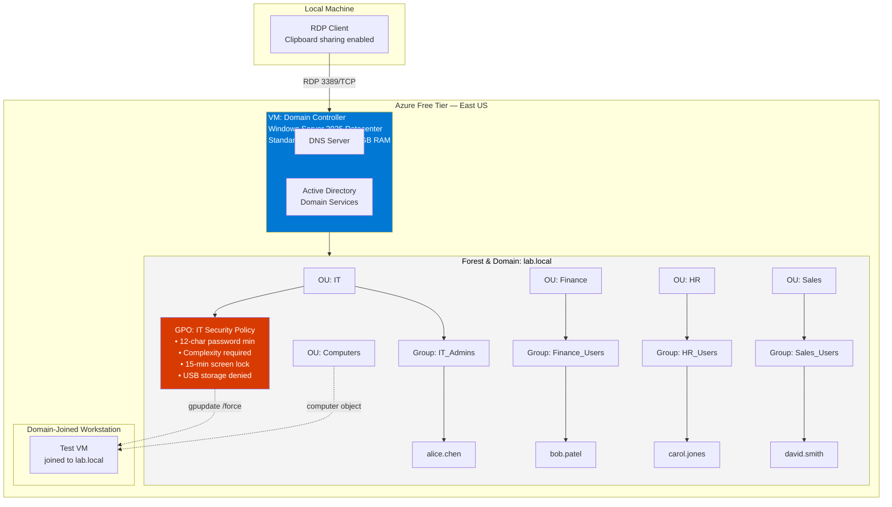

# Azure Active Directory Domain Lab

**Identity & Access Management foundations, built from scratch on Azure**


---

## Overview

This lab builds a functioning **Active Directory Domain Services (AD DS)** environment from a bare Windows Server VM — covering domain promotion, organisational structure, security groups, group-based access control, Group Policy enforcement, and the day-one help desk tasks (password resets, account unlocks, offboarding) that every IT/sysadmin/cloud/security role touches.

Active Directory is still the identity backbone for the majority of enterprise environments, and its concepts (users, groups, OUs, role-based access, policy enforcement) map directly onto cloud identity platforms like Microsoft Entra ID. This lab was built to demonstrate hands-on fluency with those concepts, not just theoretical knowledge of them.

| | |
|---|---|
| **Certification alignment** | CompTIA Network+ · Security+ · Azure Administrator |
| **Environment** | Windows Server 2025 Evaluation (180-day) on Azure Free Account |
| **Time to complete** | 3–5 hours across multiple sessions |
| **Cost** | $0 — free tier + evaluation licence |
| **Relevant roles** | IT Support · Sysadmin · Cloud Engineer · Security Analyst |

---

## Technologies

- Microsoft Azure
- Windows Server 2025
- Active Directory Domain Services
- DNS
- PowerShell
- Remote Desktop Protocol
- Group Policy Management
- Azure Virtual Machines

---

## Skills Demonstrated

- Active Directory Administration
- Windows Server Administration
- Azure Infrastructure
- Virtual Networking
- PowerShell Automation
- Identity and Access Management
- DNS Configuration
- Group Policy Management
- Remote Desktop Services
- Virtual Machine Deployment
- Domain Administration

---

## Architecture

The lab consists of a single Domain Controller running AD DS + DNS for the `lab.local` forest, an organisational unit structure mapped to departments, role-based security groups, and a Group Policy Object enforcing baseline security settings across the IT OU. A second VM domain-joins to validate that policy is actually being pushed and enforced.



**Trust boundary:** the Domain Controller is the sole authority for authentication and DNS resolution within `lab.local`. Any machine that joins the domain implicitly trusts this server's identity decisions — which is exactly why DC hardening is a top real-world security priority (Active Directory is the most targeted system in ransomware attacks).

---

## What This Lab Demonstrates

| Skill | Real-world application |
|---|---|
| Promoting a server to Domain Controller | The foundational step in every enterprise Windows environment |
| Building an OU structure | Enables policy to be applied per-department instead of per-machine |
| Creating security groups + group-based access | Role-based access control (RBAC) applied practically — grant access once at the group level, not per-user |
| Configuring Group Policy Objects (GPOs) | Centralised enforcement of password policy, session locking, and device restrictions across every machine in scope |
| Domain-joining a client machine | Turning an unmanaged workstation into a policy-enforced, monitored asset |
| Password resets, account unlocks, offboarding | The highest-volume tickets in any IT support queue, performed the correct way (disable, don't delete) |
| Auditing accounts and group membership | Baseline security hygiene — finding stale accounts and verifying access is still appropriate |

---

## Environment Setup

**Option A — Azure (used for this lab)**

| Setting | Value | Reason |
|---|---|---|
| Region | East US | Lowest cost, broadest VM size availability |
| Image | Windows Server 2025 Datacenter (Gen2) | Includes free 180-day evaluation licence |
| Size | Standard_B2s (2 vCPU / 4GB RAM) | Minimum size that runs AD DS comfortably, within free-tier credit |
| Inbound ports | RDP (3389) | Required for remote management |
| OS disk | Standard SSD | Included in free-tier storage allowance |

> VM is stopped (not deleted) between sessions to avoid burning compute credit — roughly $0.05/hr running.

**Option B — Local (VirtualBox)**
Alternative for anyone without an Azure account: Windows Server 2025 Evaluation ISO run in Oracle VirtualBox. Requires 8GB+ RAM on the host, 60GB free disk, virtualisation enabled in BIOS.

---

## Build Steps

### 1. Install the AD DS role
```powershell
Install-WindowsFeature -Name AD-Domain-Services -IncludeManagementTools
Install-WindowsFeature -Name GPMC   # Group Policy Management Console — needed later, install now
```

### 2. Promote to Domain Controller
Creates the forest, the domain (`lab.local`), and makes the server authoritative for DNS and identity.
```powershell
Import-Module ADDSDeployment
Install-ADDSForest `
  -DomainName 'lab.local' `
  -DomainNetBiosName 'LAB' `
  -InstallDns:$true `
  -SafeModeAdministratorPassword (ConvertTo-SecureString 'YourDSRMPassword!' -AsPlainText -Force) `
  -Force:$true
```

### 3. Build the OU structure
```powershell
New-ADOrganizationalUnit -Name "IT"        -Path "DC=lab,DC=local"
New-ADOrganizationalUnit -Name "Finance"   -Path "DC=lab,DC=local"
New-ADOrganizationalUnit -Name "HR"        -Path "DC=lab,DC=local"
New-ADOrganizationalUnit -Name "Sales"     -Path "DC=lab,DC=local"
New-ADOrganizationalUnit -Name "Computers" -Path "DC=lab,DC=local"
```

### 4. Create role-based security groups
```powershell
New-ADGroup -Name "IT_Admins"     -GroupScope Global -GroupCategory Security -Path "OU=IT,DC=lab,DC=local"
New-ADGroup -Name "Finance_Users" -GroupScope Global -GroupCategory Security -Path "OU=Finance,DC=lab,DC=local"
New-ADGroup -Name "HR_Users"      -GroupScope Global -GroupCategory Security -Path "OU=HR,DC=lab,DC=local"
New-ADGroup -Name "Sales_Users"   -GroupScope Global -GroupCategory Security -Path "OU=Sales,DC=lab,DC=local"
```

### 5. Create users and assign group membership
```powershell
$password = ConvertTo-SecureString "Welcome@2026!" -AsPlainText -Force

New-ADUser -Name "alice.chen" -GivenName "Alice" -Surname "Chen" `
  -SamAccountName "alice.chen" -UserPrincipalName "alice.chen@lab.local" `
  -Path "OU=IT,DC=lab,DC=local" -AccountPassword $password -Enabled $true

# ...repeated per department (see full command log in /docs)

Add-ADGroupMember -Identity "IT_Admins" -Members "alice.chen"
```

### 6. Configure and link a GPO
GPO **`IT Security Policy`** linked to the IT OU, enforcing:

| Setting | Value | Purpose |
|---|---|---|
| Minimum password length | 12 | Enforce strong passwords |
| Password complexity | Enabled | Require mixed case, number, symbol |
| Machine inactivity limit | 900 sec | Auto-lock idle sessions |
| Removable storage access | Deny all | Block USB-based data exfiltration |

Verified by joining a second VM to the domain, moving its computer object into the `IT` OU, running `gpupdate /force`, and confirming the screen-lock policy applies on login.

---

## Common Help Desk Tasks Practiced

```powershell
# Password reset with forced change on next login
Set-ADAccountPassword -Identity "bob.patel" -Reset -NewPassword (ConvertTo-SecureString "NewPass@2026!" -AsPlainText -Force)
Set-ADUser -Identity "bob.patel" -ChangePasswordAtLogon $true

# Unlock a locked account
Unlock-ADAccount -Identity "carol.jones"

# Offboarding — disable, don't delete (preserves audit history)
Disable-ADAccount -Identity "david.smith"

# Audit — accounts inactive for 90+ days
$cutoff = (Get-Date).AddDays(-90)
Get-ADUser -Filter {LastLogonDate -lt $cutoff -and Enabled -eq $true} -Properties LastLogonDate
```

---

## Verification

| Check | Command | Expected result |
|---|---|---|
| DC is running | `Get-ADDomainController` | Returns forest `lab.local` |
| OUs exist | `Get-ADOrganizationalUnit -Filter *` | Lists all 5 OUs |
| Users exist and enabled | `Get-ADUser -Filter {Enabled -eq $true}` | Lists 4 test accounts |
| Group membership correct | `Get-ADGroupMember -Identity IT_Admins` | Returns `alice.chen` |
| GPO linked | `Get-GPInheritance -Target 'OU=IT,DC=lab,DC=local'` | Shows `IT Security Policy` |

---

## Troubleshooting

| Problem | Root cause / fix |
|---|---|
| `New-ADUser` prompts for `Name:` | `$password` variable wasn't defined before the command ran — run the full script block together, not line by line |
| Clipboard doesn't work over RDP | Enable **Local Resources → Clipboard** in the RDP client, or use a downloaded `.rdp` file instead of the browser console |
| Domain promotion fails on DNS conflict | Set the NIC's preferred DNS to `127.0.0.1` before promoting |
| Can't RDP after domain join | Log in as `LAB\Administrator`, not local `Administrator` |
| GPO not applying | Run `gpupdate /force`, then `gpresult /r` to confirm which policies actually landed |
| **AD Organizational Unit path mismatch** (`DC=lab` vs `DC=Lab1VM`) | The domain's actual distinguished-name components didn't match what was assumed when writing OU paths. Confirmed the real domain DN with `Get-ADDomain \| Select DistinguishedName` and corrected every `-Path` argument to match exactly — PowerShell will not fuzzy-match a DN |
| **Built-in `Computers` container conflict** | Windows auto-creates a default `Computers` container (not a true OU) at domain creation, which cannot have GPOs linked to it. Machine objects landing there silently ignored the GPO. Fix was moving computer objects into the purpose-built `Computers` OU, or redirecting the default computer container with `redircmp` |
| **Password complexity preventing account enablement** | New accounts failed to enable because the chosen password didn't meet the domain's complexity policy (upper/lower/number/symbol, minimum length). Fixed by generating passwords that satisfied the policy before calling `-Enabled $true`, rather than enabling first and troubleshooting the failure after |
| **DNS configuration preventing domain join** | Client machines pointed at a public or ISP-provided DNS server instead of the Domain Controller, so they couldn't resolve `lab.local` or locate the domain via SRV records. Fixed by setting the client NIC's preferred DNS server to the DC's static IP before attempting the join |
| **Remote Desktop authorization for domain users** | Domain accounts couldn't RDP into member servers by default — only local Administrators group members can, out of the box. Fixed by adding the relevant domain group to the target machine's **Remote Desktop Users** local group |

---

## Lessons Learned

- **Active Directory relies on DNS for domain discovery.** A domain join isn't really an AD problem until DNS is ruled out first — clients locate the DC via DNS SRV records, and nothing else works if that resolution fails.
- **Group Policy only applies when objects are in the correct OU.** Membership in the right *security group* is not the same as location in the right *OU* — GPOs link to OUs, not groups, and a misplaced computer object will never receive the policy no matter how the groups are configured.
- **PowerShell distinguished names must match the domain exactly.** There's no fuzzy matching on `-Path` — the DN has to mirror the actual domain structure character-for-character, which means verifying it rather than assuming it.
- **Built-in Active Directory containers differ from Organizational Units.** The default `Users` and `Computers` containers look like OUs in the GUI but functionally aren't — they can't have GPOs linked to them, which trips up anyone assuming they can.
- **Domain-joined clients validate GPO deployment.** A GPO that looks correctly configured and linked in Group Policy Management isn't actually proven until a real client pulls it down and the setting takes effect — configuration and verification are two different steps.

---

## Future Improvements

- Deploy a second Domain Controller for redundancy and to practice AD replication
- Configure DHCP for automatic client addressing
- Implement Group Policy Preferences for more granular, item-level configuration
- Configure roaming user profiles
- Add Azure VPN connectivity for hybrid on-prem/cloud access
- Integrate Microsoft Entra ID (Azure AD) for hybrid identity sync

---

## Key Takeaways

- **Group-based access control scales; individual grants don't.** Assigning permissions to `Finance_Users` instead of 50 individual accounts is the difference between a five-minute offboarding and a five-hour one.
- **Disable, don't delete, on offboarding.** Preserves audit trail and group history — deletion is irreversible and destroys forensic value.
- **Policy enforcement is only real if it's tested.** The GPO wasn't considered "done" until a second machine actually pulled and applied it — configuration without verification is a false sense of security.
- **The Domain Controller is a single point of trust.** Every identity decision in the environment depends on it, which is exactly why DCs are a top ransomware target in real enterprises.

---

## Environment Teardown

VM stopped (not deleted) at the end of each session to preserve configuration while halting compute billing.

```powershell
# From Azure CLI, to deallocate and stop billing
az vm deallocate --resource-group <rg-name> --name <vm-name>
```

---

*Part of a self-directed lab series building hands-on IAM, sysadmin, and cloud security skills across Azure and Windows Server.*
